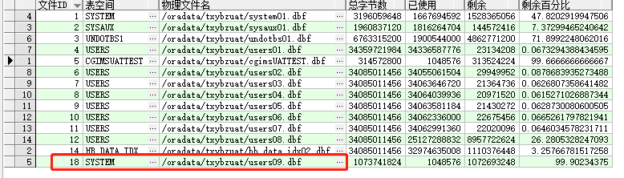
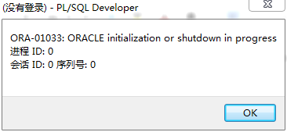
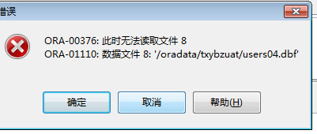

## 事发背景：

数据库需要扩容，执行新建数据文件时，由于粗心大意添加到了system下。



然后，我ssh进入该文件路径下直接删了这个文件。。。于是，第二天数据库登陆不上了，报错如下：





## 解决办法：

进入ssh,输入：

```sql
sqlplus /NOLOG

SQL>connect sys/change_on_install as sysdba;

SQL>shutdown normal;        --这里注意如果数据库暂时没人在用可以直接shutdown immediate
提示：
数据库已经关闭
已经卸载数据库
ORACLE 例程已经关闭

SQL>startup mount;
提示：
Total System Global Area 5110898688 bytes
Fixed Size                  2806480 bytes
Variable Size            1107299632 bytes
Database Buffers        3992977408 bytes
Redo Buffers                7815168 bytes

SQL>alter database open;     --这一步出错了 提示我的数据文件18找不到了，因为我删除了。

SQL>alter database create datafile '/oradata/txybzuat/users09.dbf'; --重新创建这个文件

SQL>recover datafile '/oradata/txybzuat/users09.dbf';  --恢复这个文件

SQL>startup mount;  

SQL>alter database open;     --重新连接数据库即可

```


## 彩蛋：

处理中不小心脱机(offline)了一个数据文件，很尴尬，导致同事一张表查不出来了，报错：



是因为我执行了：

```sql
SQL>alter database datafile 8 offline drop;   --这里是本来要执行18，结果执行成了8。
```


解决方法：

```sql
SQL>select name,file#,status from v$datafile;  --查询所有数据文件状态，发现这个文件offline了。

SQL>recover datafile '/oradata/txybzuat/users04.dbf'; --恢复这个文件

SQL>alter database datafile 8 online;           --更改为online即可
```


## 参考链接：

<https://www.cnblogs.com/arxive/p/9012614.html>

<http://blog.itpub.net/21256317/viewspace-1065042/>